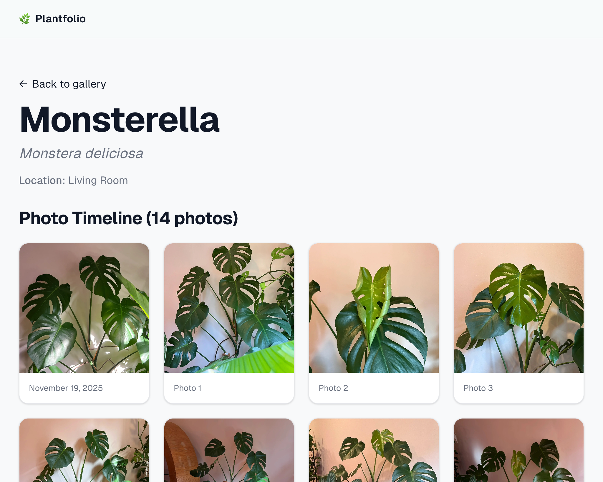

# Plantfolio

A full-stack plant gallery that transforms a mobile app's limited API into a permanent photo archive with historical growth timelines.

**[Live Demo](https://plantfolio-app.vercel.app)** · Built with Next.js 16, TypeScript, Supabase




---

## The Problem

My 50+ houseplants live in the **Planta** mobile app, which has two limitations:
- No public sharing or web view
- The API only exposes the *most recent* photo per plant — historical photos are inaccessible

**The challenge:** How do you build a photo timeline when the API overwrites previous images?

## The Solution

Plantfolio creates a **self-maintaining photo archive** through:

1. **Historical Backfill** — 400+ archived photos uploaded to cloud storage with preserved ordering
2. **Sync Endpoint** — Manual sync endpoint detects and archives new photos before they're overwritten

The result: a living gallery that grows automatically as I add photos in Planta.

---

## Technical Highlights

| Challenge | Solution |
|-----------|----------|
| API only returns latest photo | Sync system archives each photo before it's replaced |
| Photo deduplication | Compare `planta_image_url` to detect new photos |
| Token expiration during syncs | Proactive refresh when <1 hour remaining |
| API rate limiting (429 errors) | Exponential backoff with configurable retry count |
| Fresh data vs. fast loads | ISR (Incremental Static Regeneration) with hourly revalidation |

### Key Implementation: Token Refresh Strategy

```typescript
// Proactively refresh before expiration to prevent mid-sync failures
const expiresAt = new Date(tokens.expires_at)
const oneHourFromNow = new Date(Date.now() + 60 * 60 * 1000)

if (expiresAt < oneHourFromNow) {
  return await refreshAccessToken(tokens.refresh_token)
}
```

### Key Implementation: Photo Deduplication

```typescript
// Only download if we don't already have this exact photo
const { data: existingPhoto } = await supabase
  .from('photos')
  .select('id')
  .eq('planta_image_url', plantaPlant.image.url)
  .maybeSingle()

if (existingPhoto) continue // Skip - already archived
```

---

## Features

- **Growth Timelines** — Chronological photo galleries showing each plant's journey
- **Sync Endpoint** — Bearer-authenticated API for on-demand photo updates
- **Smart Sorting** — Planta photos (newest first), then historical (by display order)
- **Responsive Gallery** — 2-6 column grid adapts to any screen size
- **Interactive Lightbox** — Full-screen viewing with keyboard navigation
- **Error Boundaries** — Graceful degradation with retry functionality

---

## Architecture

<div style="overflow-x: auto;">

```
┌─────────────────┐     ┌─────────────────┐     ┌─────────────────┐
│   Planta API    │────▶│   /api/sync     │────▶│    Supabase     │
│  (single photo) │     │  (deduplication)│     │  DB + Storage   │
└─────────────────┘     └─────────────────┘     └────────┬────────┘
                                                         │
┌─────────────────┐                                      │
│   Historical    │──────────────────────────────────────┤
│   Photos (400+) │        (one-time backfill)           │
└─────────────────┘                                      ▼
                                                 ┌───────────────┐
                                                 │   Next.js     │
                                                 │   Frontend    │
                                                 └───────────────┘
```

</div>

**Database:** 3 tables
- `plants` — 54 records with names, species, locations
- `photos` — 400+ records linking plants to storage URLs
- `sync_tokens` — OAuth credentials with auto-refresh

---

## Tech Stack

| Layer | Technology | Why |
|-------|------------|-----|
| Framework | Next.js 16 (App Router) | Server Components, ISR, API routes |
| Language | TypeScript | Full-stack type safety |
| Styling | Tailwind CSS | Rapid responsive development |
| Database | Supabase (PostgreSQL) | Managed DB + file storage |
| Storage | Supabase Storage | CDN-backed image hosting |
| Testing | Vitest + React Testing Library | Fast unit and component tests |
| Hosting | Vercel | Zero-config Next.js deployment |
| Development | Claude Code | AI-assisted coding and architecture |

---

## Project Structure

```
src/
├── app/
│   ├── page.tsx              # Homepage gallery (ISR, 1hr revalidation)
│   ├── plants/[id]/page.tsx  # Plant detail with photo timeline
│   └── api/sync/route.ts     # Protected sync endpoint
├── components/
│   ├── PlantCard.tsx         # Gallery thumbnail card
│   ├── PhotoTimeline.tsx     # Chronological photo grid
│   └── PhotoLightbox.tsx     # Full-screen viewer
├── lib/
│   ├── planta-api.ts         # API client with retry logic
│   ├── supabase.ts           # Database clients (public + admin)
│   └── utils.ts              # Display name, sorting, formatting
└── types/
    └── index.ts              # TypeScript interfaces
```

---

## API Reference

### POST /api/sync

Triggers a manual sync from Planta API. Requires authentication.

```bash
curl -X POST https://plantfolio-app.vercel.app/api/sync \
  -H "Authorization: Bearer $SYNC_API_KEY"
```

**Response:**
```json
{
  "success": true,
  "plants_synced": 54,
  "photos_added": 3,
  "errors": []
}
```

---

## What I Learned

### Architecture
- **API limitations shaped the architecture** — The single-photo constraint drove the backfill + incremental sync design
- **Idempotency simplifies everything** — Making scripts safe to re-run eliminated an entire class of bugs

### Engineering Practices
- **Proactive beats reactive for auth** — Refreshing tokens *before* expiry prevents failed requests
- **Fail gracefully at boundaries** — Error boundaries per route mean one broken plant page doesn't crash the gallery

### Next.js Specifics
- **ISR balances speed and freshness** — Static pages with hourly revalidation, no loading spinners
- **Route segment configs require literals** — `revalidate` values can't be imported constants (discovered during build)

### AI-Assisted Development
- **Claude Code as a coding partner** — Used for architecture decisions, writing code, debugging, and documentation

---

## Quick Start

```bash
git clone https://github.com/lindalynallen/plantfolio.git
cd plantfolio && npm install

cp .env.example .env.local
# Edit .env.local with your Supabase credentials

npm run dev
```

**Environment Variables:**
- `NEXT_PUBLIC_SUPABASE_URL` — Supabase project URL
- `NEXT_PUBLIC_SUPABASE_ANON_KEY` — Public API key
- `SUPABASE_SERVICE_ROLE_KEY` — Admin key (server-side only)
- `PLANTA_API_BASE_URL` — Planta API endpoint
- `SYNC_API_KEY` — Bearer token for sync endpoint

---

Built with 🌱 by [Linda](https://www.linkedin.com/in/lindalynallen)
